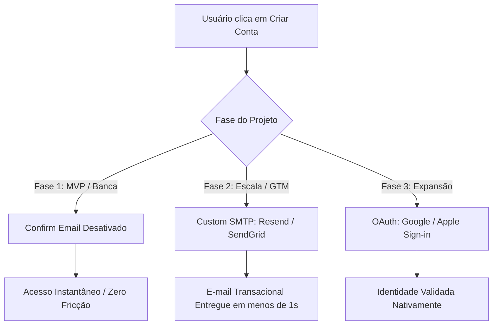
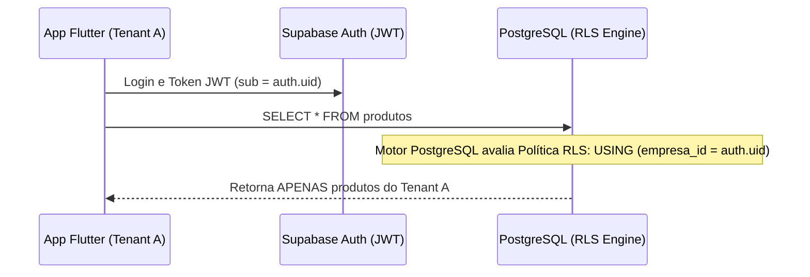
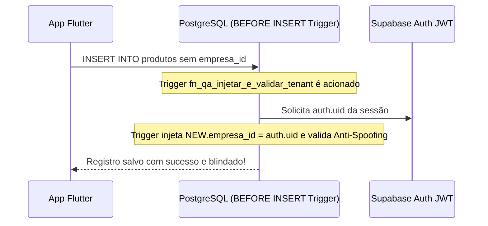
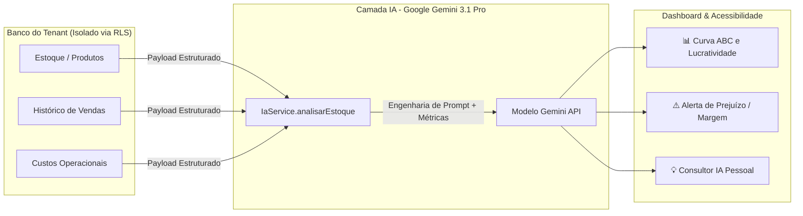

# 🏢 Estratégia Arquitetural e Operacional do SaaS App-CIC
**Documentação Técnica para Banca de Avaliação e Escala de Produção (Go-to-Market)**

---

## 1. 🔐 Estratégia de Autenticação e Disparo de E-mails (SMTP)

### O Problema (Gargalo de SMTP Gratuito)
O Supabase possui um servidor SMTP interno padrão para envio de e-mails transacionais (confirmação de conta, redefinição de senha). Para evitar abusos e SPAM na rede global, esse servidor possui um *rate limit* agressivo (aproximadamente 3 a 4 e-mails por hora). Isso limita testes de estresse em ambiente de desenvolvimento e impede a escala inicial no lançamento.

**Decisão Arquitetural:** A plataforma **Supabase continuará sendo o nosso backend principal** (PostgreSQL + Auth + Storage), pois oferece uma infraestrutura robusta, escalável e nativamente compatível com Row Level Security (RLS). O gargalo de comunicação será solucionado estrategicamente dividindo o ciclo de vida do software em três fases:

### Fase 1: Validação, Testes e Apresentação (MVP e Banca)
Para demonstrações ao vivo (bancas avaliadoras e testes de validação interna), a fricção de entrada deve ser **zero**. O fluxo não pode depender de servidores de e-mail externos nem de verificação manual de caixas de entrada/spam durante o pitch.

* **Ação:** Desativar a opção `Confirm email` no painel do Supabase (`Authentication` → `Providers` → `Email`).
* **Resultado (`One-Click Onboarding`):** Ao clicar em "Criar Conta", o usuário (mesmo com e-mails de teste como `lk@gmail.com` ou `rupestre@gmail.com`) é imediatamente autenticado no sistema. O JWT do usuário é emitido, a variável de tenant (`empresa_id = auth.uid()`) é vinculada e ele acessa diretamente o **Dashboard Inteligente**. Testes de isolamento multi-tenant são realizados e validados em segundos.

### Fase 2: Produção e Escala (Go-to-Market)
Quando o aplicativo for liberado para lojistas e empreendedores reais, a verificação de e-mail é reativada para garantir autenticidade, segurança contra *bots* e recuperação de senha. Para contornar o limite de envio do Supabase, conectaremos um provedor **Custom SMTP** profissional de terceiros diretamente no painel:
* **Resend:** Provedor otimizado para desenvolvedores com limite gratuito de **3.000 e-mails/mês** (100 por dia) e entrega em milissegundos.
* **SendGrid / Brevo:** Alternativas corporativas consolidadas, oferecendo até **300 e-mails/dia** no plano gratuito.
* **Fluxo Técnico:** O aplicativo solicita o envio ao Supabase Auth $\rightarrow$ O Supabase repassa o *payload* assinado para a API do Resend $\rightarrow$ O Resend entrega o e-mail transacional com alta reputação de IP na caixa de entrada do lojista.

### Fase 3: Autenticação Social (Frictionless OAuth)
* **Google Sign-in / Apple Sign-in:** Implementação de botões nativos OAuth no aplicativo móvel. Como os provedores sociais (Google/Apple) já realizam a verificação de identidade e e-mail na origem, o Supabase autentica o usuário sem necessidade de envio de links ou códigos transacionais, eliminando custos operacionais de SMTP e elevando a taxa de conversão no cadastro.

---

## 2. 🛡️ Isolamento Multi-Tenant via Row Level Security (RLS)

### Segurança Direta no Motor do Banco (PostgreSQL Engine)
Diferente de sistemas tradicionais que filtram dados na camada de aplicação (`WHERE empresa_id = ...` no código, suscetível a erros humanos e falhas de segurança), o App-CIC delega a segurança arquitetural para o **PostgreSQL Row Level Security (RLS)** diretamente no kernel do banco de dados.

### O Mito: "RLS depende da confirmação de e-mail?"
**Não.** A segurança por RLS no PostgreSQL (`auth.uid()`) é **100% independente do status de verificação do e-mail** (`email_confirmed_at`).
* **Como funciona o `auth.uid()`:** Sempre que um usuário faz login ou cria uma conta (seja conta verificada, conta com verificação desativada na Fase 1, ou conta Google OAuth), o Supabase gera um Token JWT que carrega a *claim* `sub` contendo o UUID único daquela conta (`ex: 1111-1111-1111-1111`).
* O motor do banco de dados intercepta toda query (`SELECT`, `INSERT`, `UPDATE`, `DELETE`) e compara rigorosamente `empresa_id = auth.uid()`.

### Diagnóstico de Acesso Indevido (Por que contas diferentes viram os mesmos dados no teste?)
Se duas contas de teste (`lk@gmail.com` e `rupestre@gmail.com`) enxergaram os mesmos produtos na tela de estoque, **isso indica que o script SQL das Políticas RLS ainda não foi executado (ou o RLS está desabilitado) na tabela `produtos` no Supabase SQL Editor**.
* Sem o RLS ativo (`ALTER TABLE produtos ENABLE ROW LEVEL SECURITY;`), ou caso exista uma política permissiva antiga (como `"Enable read access for all users"` com `USING (true)`), o banco de dados opera em modo *público/legado* e retorna todos os registros da tabela para qualquer usuário.
* **Diagnóstico e Execução:** Para ativar a blindagem definitiva, executa-se o script [supabase/rls_migration.sql](file:///c:/Users/bxtna/app_cic/supabase/rls_migration.sql) no SQL Editor do Supabase. Imediatamente após a execução, o isolamento multi-tenant se torna inviolável e nenhum usuário acessa dados de outro tenant.

### 2.1 ⚙️ Sistema de QA Automatizado e Auto-Regulável (Triggers & Stored Procedures)
Para eliminar a necessidade de auditorias e varreduras manuais no futuro, e garantir o **padrão ouro de Qualidade (QA)** na arquitetura de dados, o App-CIC implementa mecanismos ativos no kernel do PostgreSQL através de **Triggers** e **Stored Procedures** ([supabase/qa_triggers_e_procedures.sql](file:///c:/Users/bxtna/app_cic/supabase/qa_triggers_e_procedures.sql)):

1. **Trigger de Injeção e Validação de Tenant (`fn_qa_injetar_e_validar_tenant`):**
   * Acoplado nas tabelas `produtos`, `historico_vendas` e `custos_operacionais` no evento `BEFORE INSERT OR UPDATE`.
   * **Injeção Automática:** Se qualquer módulo do app tentar inserir um registro sem especificar a coluna `empresa_id`, o Trigger intercepta a operação e injeta automaticamente o ID do usuário logado (`auth.uid()`).
   * **Proteção Anti-Spoofing:** Se houver uma tentativa de manipular o payload enviando um `empresa_id` de terceiros, o Trigger corrige o valor instantaneamente para o ID real do usuário autenticado ou bloqueia a transação caso a sessão seja anônima.
2. **Stored Procedure de Auditoria e Limpeza (`sp_qa_varredura_e_limpeza_legado`):**
   * Função encapsulada no banco que audita a integridade referencial e remove dados órfãos em ordem de dependência (tabelas filhas $\rightarrow$ tabelas pai), impedindo violações de chave estrangeira (`Foreign Key Constraint`).
   * Pode ser invocada a qualquer momento com um único comando (`SELECT sp_qa_varredura_e_limpeza_legado();`) ou agendada para execução noturna via cron jobs do banco de dados (`pg_cron`), gerando um relatório JSON de conformidade em tempo real.

---

## 3. 🤖 Inteligência Artificial Preditiva e Analítica (Google Gemini & `IaService`)

O grande diferencial do App-CIC é a integração nativa com o **Google Gemini 3.1 Pro** através do serviço [`IaService`](file:///c:/Users/bxtna/app_cic/lib/services/ia_service.dart), transformando dados brutos e isolados de cada lojista em **acessibilidade estratégica, relatórios gerenciais e tomada de decisão em tempo real**.

### 3.1 Acessibilidade Analítica Direta ao Banco de Dados (`IaService`)
A IA não atua apenas com perguntas genéricas; ela possui **acesso de leitura estruturada aos dados do tenant autenticado**. Quando o lojista abre o `Dashboard & IA` ([tela_dashboard.dart](file:///c:/Users/bxtna/app_cic/lib/screens/tela_dashboard.dart)), o sistema coleta em milissegundos os dados blindados pelo RLS:
1. **Estoque Atual (`Produto`)**: Código, Nome, Lote, Quantidade em Estoque, Valor de Compra, Markup e Valor de Venda.
2. **Histórico de Vendas (`historico_vendas`)**: Itens vendidos, quantidades, preços praticados e datas exatas de movimentação.
3. **Custos Operacionais (`CustoOperacional`)**: Despesas fixas mensais da empresa (aluguel, luz, folha de pagamento, internet).

### 3.2 Motores de Análise e Funcionalidades Preditivas
A partir da correlação desses três pilares de dados, a IA do Google Gemini gera relatórios multidimensionais:

* **📊 Curva ABC e Classificação de Lucro:** O aplicativo cruza a quantidade em estoque com o lucro projetado `(valorVenda - valorCompra) * quantidade` e cataloga os itens em Classe A (80% da lucratividade), Classe B e Classe C, orientando o lojista sobre quais produtos merecem reposição prioritária ou promoções para desova.
* **⚠️ Alerta Crítico de Prejuízo e Sobrevivência Operacional:** O `IaService` e o Dashboard calculam a soma de todos os custos operacionais da empresa contra o lucro bruto projetado do estoque. Se `Lucro Projetado < Custos Operacionais`, o app exibe um alerta preventivo em destaque, avisando ao empreendedor que a margem de lucro atual não cobre as despesas fixas do negócio antes mesmo do mês fechar.
* **📈 Visão Preditiva de Fluxo de Caixa e Capital Parado:** A inteligência artificial analisa a velocidade de giro (`vendidas`), identifica capital imobilizado em produtos encalhados e sugere ajustes dinâmicos de *Markup* para otimizar o fluxo de caixa.
* **💬 Consultor IA Interativo (Acessibilidade em Linguagem Natural):** O usuário pode interagir diretamente com a IA via chat/consultor, perguntando em português simples: *"Quais produtos devo comprar este mês?"* ou *"Como posso reduzir meu custo operacional em 10%?"*. A IA responde com base real nos números bancados pelo Supabase daquela micro ou pequena empresa.

---

## 4. Conclusão: Prontidão para Apresentação e Escala
Com essa arquitetura trifásica:
1. **O Onboarding (Fase 1)** garante **testes instantâneos e sem fricção** para a banca avaliadora.
2. **O Banco de Dados PostgreSQL + RLS** garante **blindagem de dados de nível bancário**, onde nenhum tenant enxerga dados de outro.
3. **A Inteligência Artificial do Google Gemini (`IaService`)** entrega uma experiência **SaaS de alto valor agregado**, democratizando análises financeiras complexas em insights acessíveis para o pequeno varejista.

---

## 5. Roadmap: Painel Gerencial Web (SaaS Dashboard)

### 5.1 Arquitetura do Portal Web
Para entregar uma experiência de análise de dados premium aos lojistas (Dashboards, KPIs e Predições), expandiremos o aplicativo mobile para um portal **Flutter Web**.
* **Vantagem:** Reutiliza 100% da inteligência do Supabase e das regras de segurança (RLS) já criadas para o mobile.
* **Segurança:** Ao logar na Web, o banco de dados continua filtrando automaticamente os dados de cada loja baseando-se no `auth.uid()`. Nenhum lojista vê o faturamento do outro.

### 5.2 Bibliotecas Necessárias
O código do portal web precisará de pacotes de visualização de dados de alta qualidade para substituir o Looker Studio:
* `fl_chart`: Para gráficos de linhas (faturamento) e barras (produtos mais vendidos).
* `data_table_2`: Para tabelas de fluxo de caixa responsivas.
* `google_fonts`: Para tipografia moderna e design limpo.

### 5.3 Estrutura de Telas (Web)
* **Login Web:** Porta de entrada segura para gerentes/donos.
* **Visão Geral (Dashboard):** Cards de KPIs (Lucro, Vendas do Dia) e Gráfico de Faturamento Mensal.
* **Inteligência (IA Preditiva):** Integração com o `IaService` já existente para gerar relatórios preditivos diretos na tela do computador.
